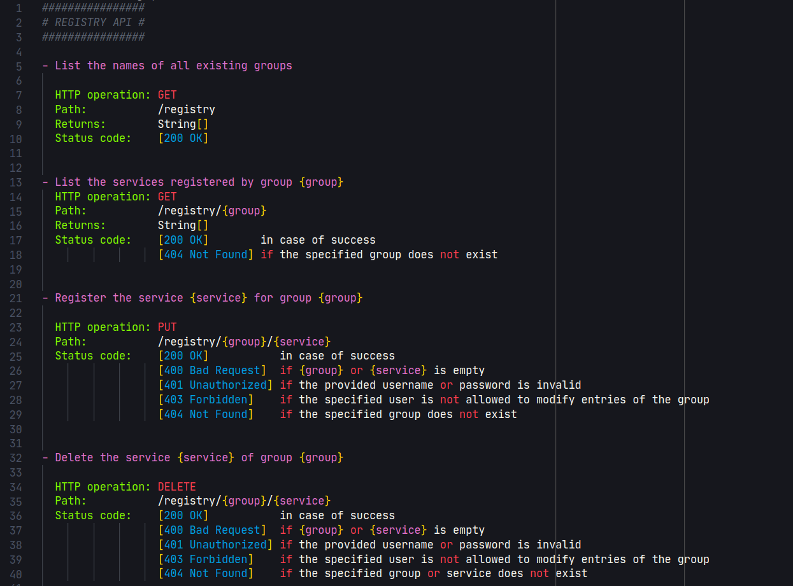

# "Language support" for mwcc-readme files



This adds very crude (honestly I don't know what I did here) language support for the `.readme` files from my `middle ware cloud computing` class at the [FAU](https://www.fau.de/).

This was mainly done to procrastinate from doing my exercises. 🤣

The language support is probably implemented in a completely wrong way (I just used some tokens without paying attention to their meaning) - Also, I didn't read the documentation and for me it was enough that it shows some of the file in color 🤣🤣.

I only had half an hour to do this, so that and that it's not really needed is my excuse for it being so bad - I had fun skimming it.

## Installation
Since I did for obvious reasons not publish this to the marketplace, you have to install it manually.

To do this just clone this repository into your `~/.vscode/extensions` folder:

```bash
git clone https://github.com/HoroTW/mw-cc.readme-0.1.git ~/.vscode/extensions/mw-cc.readme-0.1
```
After that you need to do a reload of VSCode (or just restart it) and you should be good to go.
Reload VSCode: `Ctrl + Shift + P` -> `Reload Window`